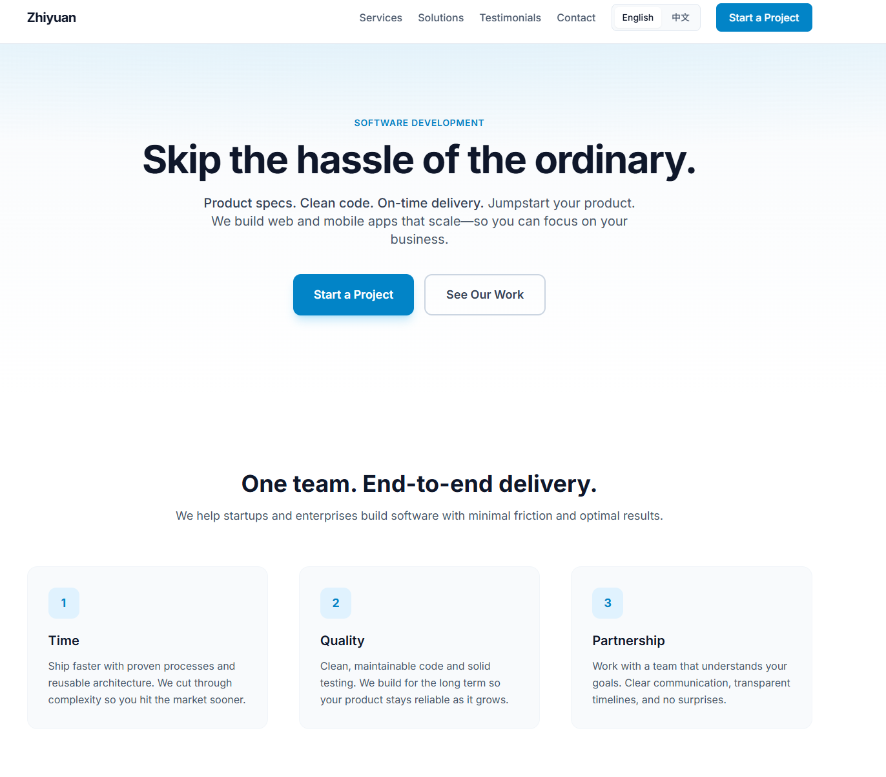
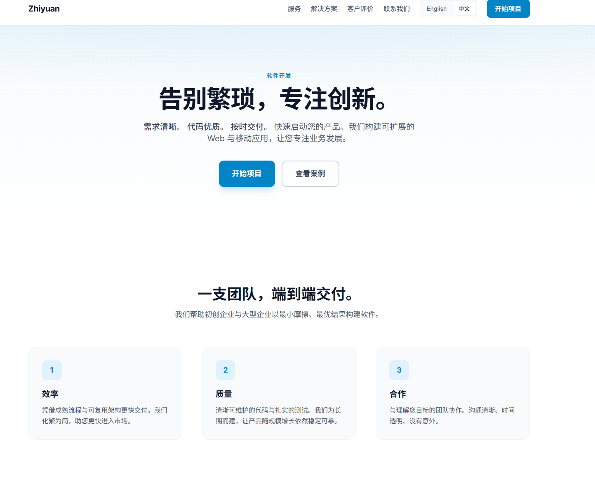

# Zhiyuan – Software Development Website

A marketing website for a software development business, built with **Next.js 14** and **Tailwind CSS**, inspired by [Boutir](https://www.boutir.com/en).

## Features

- **Next.js 14** (App Router)
- **Tailwind CSS** for styling
- **TypeScript**
- **i18n** – English and Chinese (中文) via [next-intl](https://next-intl.dev)
- **Language switch** in the navbar (English / 中文)
- Responsive layout with mobile navigation
- Sections: Hero, Value Props, Features, Services, Solutions, Testimonials, Client Logos, CTA, Footer

## Getting Started

1. Install dependencies:

   ```bash
   npm install
   ```

2. Run the development server:

   ```bash
   npm run dev
   ```

3. Open [http://localhost:3000](http://localhost:3000) in your browser. You’ll be redirected to `/en` or your preferred locale. Use `/en` for English and `/zh` for 中文.

## Scripts

- `npm run dev` – Start development server
- `npm run build` – Build for production
- `npm run start` – Start production server
- `npm run lint` – Run ESLint

## 页面截图






## Customization

- **Brand name**: Search for "Zhiyuan" in `app/layout.tsx`, `components/Header.tsx`, `components/Footer.tsx`, and metadata.
- **Contact email**: Update `hello@zhiyuan.dev` in `components/CTA.tsx` and `components/Footer.tsx`.
- **Colors**: Edit `tailwind.config.ts` and `app/globals.css` for primary/accent colors.
- **Content**: Edit copy in each component under `components/`.
- **Translations**: Edit `messages/en.json` and `messages/zh.json`. Add or change keys and use `useTranslations('namespace')` or `t('key')` in components.
